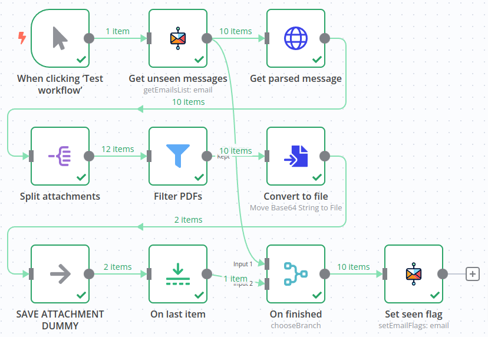

# Gp-Imap-Rest-Api

This is a small program that can be executed via Docker. 
The calls are passed as HTTP requests.
The return is always a JSON string.
This program is based on the wonderful work of 
[ImapFlow](https://github.com/postalsys/imapflow) and 
[Postal-Mime](https://github.com/postalsys/postal-mime).

What can the program do so far?

- List all IMAP mailboxes.
- List the UIDs of all messages in a mailbox.
- Parse and return a message including attachments (Base64 encoded).

This is all the program can do at the moment, but further functions are planned.


## Docker-Compose File

This Docker Compose file is all you need to start the server.
No data is saved.

_docker-compose.yaml:_

```yaml
services:
  gp-imap-rest-api:
    image: ghcr.io/gerold-penz/gp-imap-rest-api
    ports:
      - "3000:3000"
```


## Data storage

**No data is saved.**
Each request must contain the credentials to the IMAP server in the header.


## HTTP Header
with IMAP credentials

Every HTTP request to the “Gp-Imap-Rest-Api Server” must contain the 
access data to the IMAP server.
To ensure that this is not transferred in plain text, 
this access data must be transferred in the HTTP header.
If HTTPS is used, the header is transmitted to the server in encrypted form.

The header entries required for this all start with `X-Imap-`.

### X-Imap Headers

Descriptions taken from the 
[documentation of ImapFlow](https://imapflow.com/module-imapflow-ImapFlow.html)

_Example:_
```http request
X-Imap-Host: imap.example.com
X-Imap-Port: 993
X-Imap-Secure: true
X-Imap-User: exampleuser@example.com
X-Imap-Pass: examplePassword123
```

#### `X-Imap-Host`

Hostname of the IMAP server

#### `X-Imap-Port`

Port number for the IMAP server

#### `X-Imap-Secure`

`true|false`

_optional_, Standard: false

Should the connection be established over TLS.
If `false` then connection is upgraded to TLS using STARTTLS 
extension before authentication.

#### `X-Imap-Servername`

_optional_

Servername for SNI (or when host is set to an IP address).


#### `X-Imap-User`

Username for plain-text authentication.

#### `X-Imap-Pass`

_optional_

Password for plain-text authentication.

#### `X-Imap-Access-Token`

_optional_

OAuth2 Access Token, if using OAuth2 authentication.


## Usage


### Get all mailboxes

```http
GET https://<Server URL>/api/mailboxes/
X-Imap-Host: <IMAP_HOST>
X-Imap-Port: <IMAP_PORT>
X-Imap-Secure: <IMAP_SECURE>
X-Imap-User: <IMAP_USER>
X-Imap-Pass: <IMAP_PASS>
```

#### Example

```http request
GET https://gp-imap-rest-api.gerold-penz.at/api/mailboxes/
X-Imap-Host: imap.example.com
X-Imap-Port: 993
X-Imap-Secure: true
X-Imap-User: exampleuser@example.com
X-Imap-Pass: examplePassword123
```

```shell
curl --request GET \
  --url https://gp-imap-rest-api.gerold-penz.at/api/mailboxes/ \
  --header 'X-Imap-Host: imap.example.com' \
  --header 'X-Imap-Port: 993' \
  --header 'X-Imap-Secure: true' \
  --header 'X-Imap-User: exampleuser@example.com' \
  --header 'X-Imap-Pass: examplePassword123'
```

_Response:_

```json
{
  "success": true,
  "mailboxes": [
    {
      "path": "Drafts",
      "pathAsListed": "Drafts",
      "flags": [
        "\\HasNoChildren",
        "\\UnMarked",
        "\\Drafts"
      ],
      "delimiter": "/",
      "listed": true,
      "parentPath": "",
      "parent": [],
      "name": "Drafts",
      "subscribed": true,
      "specialUse": "\\Drafts",
      "specialUseSource": "extension"
    },
    {
      "path": "INBOX",
      "pathAsListed": "INBOX",
      "flags": [
        "\\HasNoChildren"
      ],
      "delimiter": "/",
      "listed": true,
      "parentPath": "",
      "parent": [],
      "name": "INBOX",
      "subscribed": true,
      "specialUse": "\\Inbox",
      "specialUseSource": "name"
    },
    {
      "path": "Junk",
      "pathAsListed": "Junk",
      "flags": [
        "\\HasNoChildren",
        "\\UnMarked",
        "\\Junk"
      ],
      "delimiter": "/",
      "listed": true,
      "parentPath": "",
      "parent": [],
      "name": "Junk",
      "subscribed": true,
      "specialUse": "\\Junk",
      "specialUseSource": "extension"
    },
    {
      "path": "Sent",
      "pathAsListed": "Sent",
      "flags": [
        "\\HasNoChildren",
        "\\UnMarked",
        "\\Sent"
      ],
      "delimiter": "/",
      "listed": true,
      "parentPath": "",
      "parent": [],
      "name": "Sent",
      "subscribed": true,
      "specialUse": "\\Sent",
      "specialUseSource": "extension"
    },
    {
      "path": "Templates",
      "pathAsListed": "Templates",
      "flags": [
        "\\HasNoChildren",
        "\\UnMarked"
      ],
      "delimiter": "/",
      "listed": true,
      "parentPath": "",
      "parent": [],
      "name": "Templates",
      "subscribed": true
    },
    {
      "path": "Trash",
      "pathAsListed": "Trash",
      "flags": [
        "\\HasNoChildren",
        "\\UnMarked",
        "\\Trash"
      ],
      "delimiter": "/",
      "listed": true,
      "parentPath": "",
      "parent": [],
      "name": "Trash",
      "subscribed": true,
      "specialUse": "\\Trash",
      "specialUseSource": "extension"
    }
  ]
}
```


### Get all message UIDs of one mailbox

```http
GET https://<Server URL>/api/mailboxes/<Mailbox Path>
X-Imap-Host: <IMAP_HOST>
X-Imap-Port: <IMAP_PORT>
X-Imap-Secure: <IMAP_SECURE>
X-Imap-User: <IMAP_USER>
X-Imap-Pass: <IMAP_PASS>
```

#### Example

```http request
GET https://gp-imap-rest-api.gerold-penz.at/api/mailboxes/INBOX
X-Imap-Host: imap.example.com
X-Imap-Port: 993
X-Imap-Secure: true
X-Imap-User: exampleuser@example.com
X-Imap-Pass: examplePassword123
```

```shell
curl --request GET \
  --url https://gp-imap-rest-api.gerold-penz.at/api/mailboxes/INBOX \
  --header 'X-Imap-Host: imap.example.com' \
  --header 'X-Imap-Port: 993' \
  --header 'X-Imap-Secure: true' \
  --header 'X-Imap-User: exampleuser@example.com' \
  --header 'X-Imap-Pass: examplePassword123'
```

_Response:_

```json
{
  "success": true,
  "uids": [
    17563,
    17684,
    17685,
    17686,
    17701,
    17703,
    17704,
    17711
  ],
  "total": 8
}
```


### Get parsed message with attachments

```http
GET https://<Server URL>/api/mailboxes/<Mailbox Path>/messages/<Message UID>
X-Imap-Host: <IMAP_HOST>
X-Imap-Port: <IMAP_PORT>
X-Imap-Secure: <IMAP_SECURE>
X-Imap-User: <IMAP_USER>
X-Imap-Pass: <IMAP_PASS>
```

#### Example

```http request
GET https://gp-imap-rest-api.gerold-penz.at/api/mailboxes/INBOX/messages/1234
X-Imap-Host: imap.example.com
X-Imap-Port: 993
X-Imap-Secure: true
X-Imap-User: exampleuser@example.com
X-Imap-Pass: examplePassword123
```

```shell
curl --request GET \
  --url https://gp-imap-rest-api.gerold-penz.at/api/mailboxes/INBOX/messages/1234 \
  --header 'X-Imap-Host: imap.example.com' \
  --header 'X-Imap-Port: 993' \
  --header 'X-Imap-Secure: true' \
  --header 'X-Imap-User: exampleuser@example.com' \
  --header 'X-Imap-Pass: examplePassword123'
```

## Usage inside a N8N workflow



The "Get parsed message" node is the HTML request which 
uses the Gp-Imap-Rest-Api to fetch the attachments.

